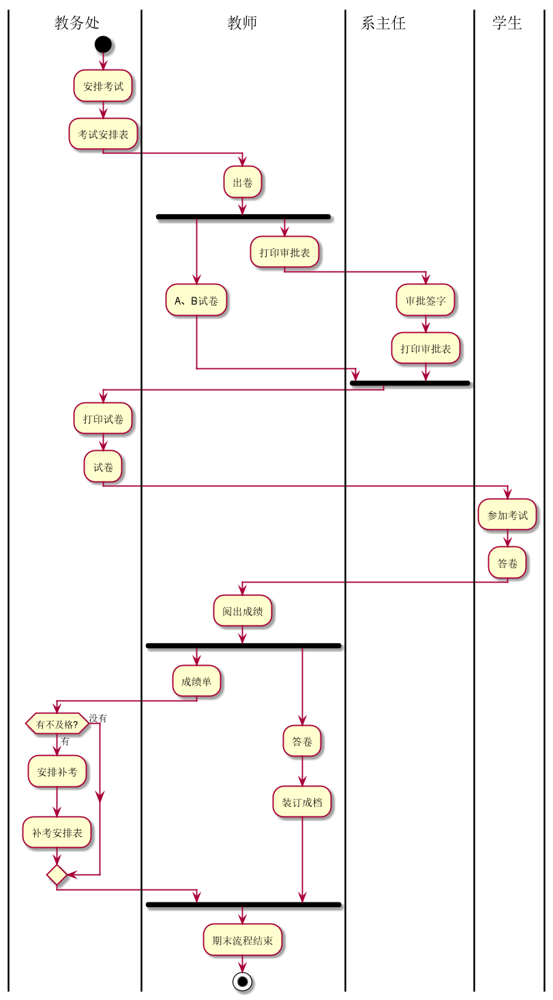
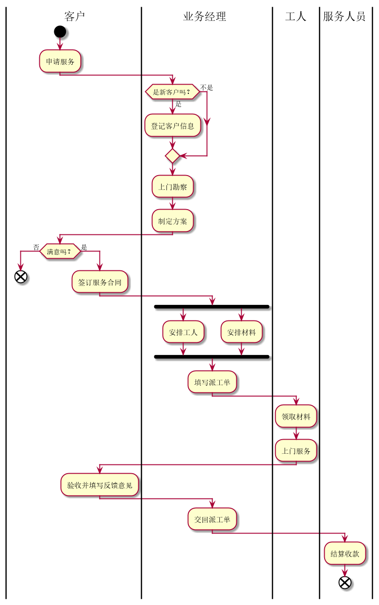

学号|班级|姓名|照片|
|:-------:|:-------------: | :----------:|:---:|
|201710414319|软件(本)17-3|王珍||

## 流程图1：考试及成绩管理流程

**PlantUML源码如下：**

``` flow1
@startuml
|教务处|
start
:安排考试;
:考试安排表;
|教师|
:出卷;
fork
   :A、B试卷;
fork again
   :打印审批表;
|系主任|
:审批签字;
:打印审批表;
end fork
|教务处|
:打印试卷;
:试卷;
|学生|
:参加考试;
:答卷;
|教师|
:阅出成绩;
fork
:成绩单;
|教务处|
if (有不及格?) then (有)
 :安排补考;
 :补考安排表;
 else (没有)
endif
|教师|
fork again
:答卷;
:装订成档;
end fork
:期末流程结束;
stop
@enduml
```

**业务流程图如下：**



**流程说明：**

第一步由教务处安排考试，做好考试安排表，老师收到考试安排表开始出卷，分为A、B试卷并打印审批表交由系主任。
系主任收到审批表后审批签字再打印审批表交由教务处。教务处收到来自系主任的审批表后打印试卷。
学生在考试日领到试卷参加考试、答卷。学生答完卷后教师收齐试卷并阅卷出成绩，随后打印成绩单并将试卷装订存档。教务处收到成绩单后查看 是否有不合格的学生，有则安排补考，并制定补考安排表。


## 流程图2： 客户维修服务流程

**PlantUML源码如下：**

``` flow2
@startuml
|客户|
start
:申请服务;
|业务经理|
if(是新客户吗？) then (是)
   :登记客户信息;
else(不是)
endif
   :上门勘察;
   :制定方案;
|客户|
if(满意吗？) then(否)
    end;
else(是)
    :签订服务合同;
|业务经理|
    fork
       :安排工人;
    fork again
       :安排材料;
    end fork
       :填写派工单;
|工人|
:领取材料;
:上门服务;
|客户|
:验收并填写反馈意见;
|业务经理|
:交回派工单;
|服务人员|
:结算收款;
end
@enduml
```

**业务流程图如下：**



**流程说明：**

起始由客户申请服务，业务经理收到客户申请服务时查看申请服务人是否是新客户，是则先登记客户信息再上门勘察，否则直接上门勘察。勘察结束后制定方案并发送给客户。
客户收到方案后决断是否满意，否则到此结束，是则签订服务合同。业务经理收到客户签的服务合同后就开始安排工人、安排材料，安排完成后填写派工单交于工人。
工人收到派工单就去领取材料，然后上门服务。服务结束后客户验收并填写反馈意见给业务经理。业务经理再交回派工单，服务人员收到后结算收款。