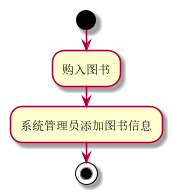

学号|班级|姓名|
|:-------:|:-------------: | :----------:|
|201710414319|软件(本)17-3|王珍
# 实验2：图书管理系统用例建模

## 1. 图书管理系统的用例关系图

### 1.1 用例图PlantUML源码如下：

```
@startuml
left to right direction
系统管理员 --> (图书管理)
(图书管理) .>(添加图书信息):<<include>>
(图书管理) ..>(查询图书信息):<<include>>
(图书管理) ..>(编辑图书信息):<<include>>
(图书管理) ..>(系统登录):<<include>>
系统管理员 --> (用户管理)
(用户管理) ..>(系统登录)
(用户管理) ..>(添加用户信息):<<include>>
(用户管理) ..>(编辑用户信息):<<include>>
(用户管理) ..>(查询用户信息):<<include>>

图书管理员 -->(图书归还)
(收罚款) .>(图书归还):<<extend>>
图书管理员 -->(图书借出)
图书管理员 ->(处理预约)
(处理预约).>(图书借出):<<extend>>
(图书借出)..>(检测读者账户):<<include>>

读者-->(借阅图书)
读者-->(查询图书)
读者-->(预约图书)
读者-->(登录系统)
读者-->(查询记录)
读者-->(归还图书)

(借阅图书)..>(查询图书):<<include>>
(借阅图书)..>(登录系统):<<include>>
(预约图书)..>(查询图书):<<include>>
(预约图书)..>(登录系统):<<include>>
(查询记录)..>(登录系统):<<include>>
(归还图书)..>(登录系统):<<include>>
(归还图书)..>(缴纳罚款):<<extend>>

系统管理员 ->图书管理员
@enduml
```

### 1.2. 用例图如下：


## 2. 参与者说明：

### 2.1 图书管理员

主要职责是：负责图书的管理，包括处理图书的归还管理，对读者图书预约情况的处理。

### 2.2 读者

主要职责是：主要包括预约图书、查询图书、借阅图书、查询借阅记录、归还图书等。

### 2.3 其他类型用户

**系统管理员**

主要职责是：包括图书的管理以及图书管理员的管理，其中图书的管理包括图书购买、丢失后对图书信息的跟新情况的处理，用户管理包括对读者信息以及图书管理员信息变动后的更新。

## 3. 用例规约表

### 3.1 “借出图书”用例


| 用例名称 | 借出图书                                       |
|:-------- | ---------------------------------------------- |
| 参与者   | 图书管理员（图书管理员)、读者(次要参与者)      |
| 前置条件 | 图书管理员已被识别和授权                       |
| 后置条件 | 存储借书记录，更新库存数量，所借图书状态为借出 |


主事件流

| 参与者动作                                                   | 系统行为                                                     |
| ------------------------------------------------------------ | ------------------------------------------------------------ |
| 1.图书管理员将读者借书卡提供给系统； <br />3.图书管理员将读者所借图书输入系统； <br />6.重复3~5，直到图书管理员确认全部图书登记完毕； | 2.系统验证读者身份和借书条件； <br />4.系统记录借书信息，并且修改图书的状态和此种书的可借数量；         <br />5.系统累加读者的借书数量；<br />7.系统打印结束清单，交易成功完成 |

| 备选事件流                                                   |
| ------------------------------------------------------------ |
| 2a.读者身份和借书条件不符合<br />①系统提示读者身份和借书条件不符合，用例结束<br />4a.系统查询借书信息<br />①系统查看借书状态，若借书数量为0，系统提示该书暂时不可借<br />②否则，修改图书状态<br />5a.系统记录读者借书数量<br />①若借书量超标，则提示不可借<br />②若未超，则累加读者的借书数量 |

| 业务规则                                                     |
| ------------------------------------------------------------ |
| 1.一个读者可以多次借书<br />2.图书状态为不可借的书，不能选择借书<br />3.读者借书数量达标以后，不能再借 |

**“借出图书”用例流程图源码如下：**


### 3.2 “购入图书”用例

| 用例名称 | 购入图书                 |
| :------- | ------------------------ |
| 参与者   | 系统管理员               |
| 前置条件 | 系统管理员已被识别和授权 |
| 后置条件 | 图书状态的改变           |

主事件流

| 参与者动作                                                   | 系统行为                                            |
| ------------------------------------------------------------ | --------------------------------------------------- |
| 2系统管理员将所购图书入库 <br />3.系统管理员管理图书，添加管理图书信息； | 1. 系统验证系统管理员的身份<br />4.系统更新图书信息 |

| 备选事件流                                                   |
|:------------------------------------------------------------ |
| 1a.读者身份和借书条件不符合<br />①系统提示管理员身份和购书条件不符合，用例结束 |

| 业务规则                            |
| ----------------------------------- |
| 1a.只有系统管理员具有图书管理的权限 |

**“购入图书”用例流程图源码如下：**

```
@startuml
start
:购入图书;
:系统管理员添加图书信息;
stop
@enduml
```



### 3.3 “预约图书”用例

| 用例名称 | 借出图书                       |
| :------- | ------------------------------ |
| 参与者   | 读者                           |
| 前置条件 | 读者具有预约权限               |
| 后置条件 | 更新图书状态，更新可借图书数量 |

主事件流

| 参与者动作                                                   | 系统行为                                                     |
| ------------------------------------------------------------ | ------------------------------------------------------------ |
| 1.读者登入系统； <br />3.读者查询图书状态； <br />5.读者申请预约图书 | 2.系统验证读者身份和借书条件； <br />4.系统返回该图书状态；<br />6.系统更改图书状态，并更新可预约书数量。 |

| 备选事件流                                                   |
| ------------------------------------------------------------ |
| 2a.读者身份和借书条件不符合<br />①系统提示读者身份和借书条件不符合，用例结束<br />4a.系统返回图书状态<br />①若图书不可借，提示用户该书不可预约<br />6a.更新用户可借书数量<br />①若预约书数量超标，则提示不可预约<br />②若未超，则累加读者的预约书数量 |

| 业务规则                                                     |
| ------------------------------------------------------------ |
| 1.一个读者在可借数量内可预约多本书<br />2.图书状态为不可借的书，不可预约<br />3.超出借书数量下，读者归还书后，可预约新书 |

**“预约图书”用例流程图源码如下：**

```
@startuml
(*) -->读者登入系统
if "系统验证读者身份" then
-->[true]"读者查询图书状态"
-->"系统返回该图书状态"
-->"读者申请预约图书"
if "系统验证读者借书数量是否超标" then

if "图书不可借" then
-->[true]"提示用户该书不可预约"
-->(*)
else
if "预约人数超标" then
-->[true]"提示预约人数超标不可预约"
-->(*)
else
-->[false]"累加预约读者的数量"
-->" 系统更改图书状态，更新可预约书数量"
-->"更新用户可借(预约)书的的数量"
-->(*)
endif
endif
else
-->[false]"借书数量超标"
-->"还书"
-->"读者申请预约图书"
endif

else
-->[false]"系统提示读者身份和借书条件不符合"
-->(*)


endif
@enduml

```


