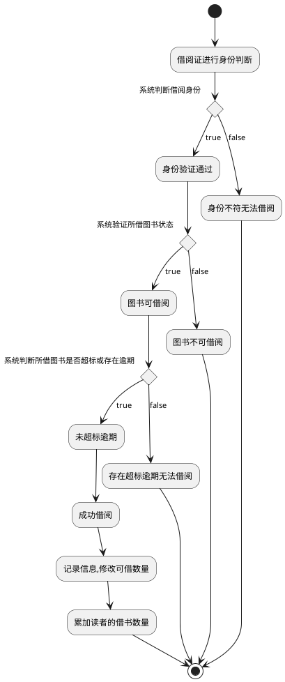

##  **借出图书用例**  

| 用例名称 | 借出图书                                       |
|:-------- | ---------------------------------------------- |
| 参与者   | 图书管理员（图书管理员)、读者(次要参与者)      |
| 前置条件 | 图书管理员已被识别和授权                       |
| 后置条件 | 存储借书记录，更新库存数量，所借图书状态为借出 |

主事件流

| 参与者动作                                                   | 系统行为                                                     |
| ------------------------------------------------------------ | ------------------------------------------------------------ |
| 1.图书管理员将读者借书卡提供给系统；  3.图书管理员将读者所借图书输入系统；  6.重复3~5，直到图书管理员确认全部图书登记完毕； | 2.系统验证读者身份和借书条件；  4.系统记录借书信息，并且修改图书的状态和此种书的可借数量；          5.系统累加读者的借书数量； 7.系统打印结束清单，交易成功完成 |

| 备选事件流                                                   |
| ------------------------------------------------------------ |
| 2a.读者身份和借书条件不符合 ①系统提示读者身份和借书条件不符合，用例结束 4a.系统查询借书信息 ①系统查看借书状态，若借书数量为0，系统提示该书暂时不可借 ②否则，修改图书状态 5a.系统记录读者借书数量 ①若借书量超标，则提示不可借 ②若未超，则累加读者的借书数量 |

| 业务规则                                                     |
| ------------------------------------------------------------ |
| 1.一个读者可以多次借书 2.图书状态为不可借的书，不能选择借书 3.读者借书数量达标以后，不能再借 |

**“借出图书”用例流程图源码如下：**

