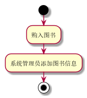

##  **购入图书用例**  

| 用例名称 | 购入图书                 |
| :------- | ------------------------ |
| 参与者   | 系统管理员               |
| 前置条件 | 系统管理员已被识别和授权 |
| 后置条件 | 图书状态的改变           |

主事件流

| 参与者动作                                                   | 系统行为                                            |
| ------------------------------------------------------------ | --------------------------------------------------- |
| 2系统管理员将所购图书入库 <br />3.系统管理员管理图书，添加管理图书信息； | 1. 系统验证系统管理员的身份<br />4.系统更新图书信息 |

| 备选事件流                                                   |
|:------------------------------------------------------------ |
| 1a.读者身份和借书条件不符合<br />①系统提示管理员身份和购书条件不符合，用例结束 |

| 业务规则                            |
| ----------------------------------- |
| 1a.只有系统管理员具有图书管理的权限 |

**“购入图书”用例流程图源码如下：**

```
@startuml
start
:购入图书;
:系统管理员添加图书信息;
stop
@enduml
```

