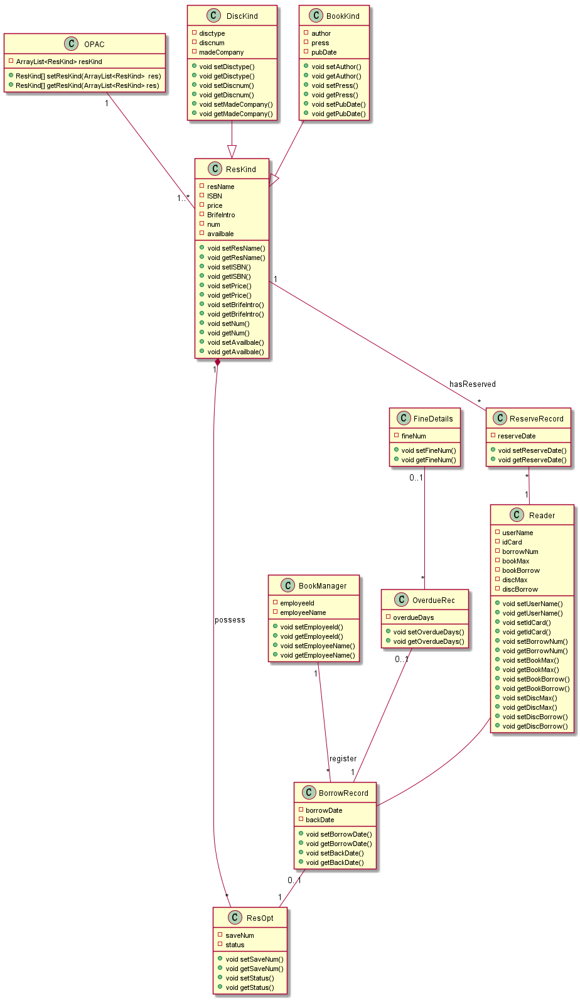

# 实验3：图书管理系统领域对象建模

| 学号         | 班级         | 姓名     |       
| ------------ | ------------ | -------- | 
| 201710414121 | 软件(本)17-3 | 王珍 | 

## 1. 图书管理系统的类图

### 1.1 类图PlantUML源码如下：

```
@startuml


'在类OPAC（馆藏目录）中记录了所有的馆藏资源品种
class OPAC
{
   -ArrayList<ResKind> resKind
 {method} +ResKind[] setResKind(ArrayList<ResKind>  res)
{method} +ResKind[] getResKind(ArrayList<ResKind> res)
}
'在类ResKind（馆藏资源品种）类中记录了各自的馆藏资源品种，封装属性有资源名称，国际出版号，价格，简介，馆藏数量，可借数量
class ResKind{
-resName
-ISBN
-price
-BrifeIntro
-num
-availbale
{method} +void setResName()
{method} +void getResName()
{method} +void setISBN()
{method} +void getISBN()
{method} +void setPrice()
{method} +void getPrice()
{method} +void setBrifeIntro()
{method} +void getBrifeIntro()
{method} +void setNum()
{method} +void getNum()
{method} +void setAvailbale()
{method} +void getAvailbale()

}
OPAC "1" -- "1..*" ResKind

'在ReserveRecord（预定记录）类中封装了预定日期
class ReserveRecord{
-reserveDate
{method} +void setReserveDate()
{method} +void getReserveDate()
}
ResKind "1" -- "*" ReserveRecord:hasReserved

'在Reader（读者）类中封装了用户姓名，身份证号，借书卡号，图书限额，已借图书数，碟片限额，已借碟片数
class Reader{
-userName
-idCard
-borrowNum
-bookMax
-bookBorrow
-discMax
-discBorrow
{method} +void setUserName()
{method} +void getUserName()
{method} +void setIdCard()
{method} +void getIdCard()
{method} +void setBorrowNum()
{method} +void getBorrowNum()
{method} +void setBookMax()
{method} +void getBookMax()
{method} +void setBookBorrow()
{method} +void getBookBorrow()
{method} +void setDiscMax()
{method} +void getDiscMax()
{method} +void setDiscBorrow()
{method} +void getDiscBorrow()

}

ReserveRecord "*" -- "1" Reader

'在BorrowRecord（借书记录）类中封装了借书日期，归还日期
class BorrowRecord{
-borrowDate
-backDate
{method} +void setBorrowDate()
{method} +void getBorrowDate()
{method} +void setBackDate()
{method} +void getBackDate()
}
Reader -- BorrowRecord

'在ResOpt（资源项）类中封装了馆藏流水号，状态
class ResOpt{
-saveNum
-status
{method} +void setSaveNum()
{method} +void getSaveNum()
{method} +void setStatus()
{method} +void getStatus()
}
BorrowRecord "0..1" --"1"ResOpt

ResOpt "*" --* "1" ResKind :possess

'在DiscKind（碟片品种）类中封装了碟片类型，碟片数，制作公司
class DiscKind{
-disctype
-discnum
-madeCompany
{method} +void setDisctype()
{method} +void getDisctype()
{method} +void setDiscnum()
{method} +void getDiscnum()
{method} +void setMadeCompany()
{method} +void getMadeCompany()

}

'在BookKind（图书品种）类中封装了作者，出版社，出版日期
class BookKind{
-author
-press
-pubDate
{method} +void setAuthor()
{method} +void getAuthor()
{method} +void setPress()
{method} +void getPress()
{method} +void setPubDate()
{method} +void getPubDate()
}
DiscKind --^ ResKind
BookKind  --^ ResKind

'在BookManager（图书管理员）类中封装了职工号，姓名
class BookManager{
-employeeId
-employeeName
{method} +void setEmployeeId()
{method} +void getEmployeeId()
{method} +void setEmployeeName()
{method} +void getEmployeeName()
}
BookManager  "1" -- "*" BorrowRecord:register

'在OverdueRec（逾期记录）类中封装了逾期天数
class OverdueRec{
-overdueDays
{method} +void setOverdueDays()
{method} +void getOverdueDays()
}
OverdueRec "0..1" -- "1" BorrowRecord

'在FineDetails（罚款细则）类中封装了罚款数
class FineDetails{
-fineNum
{method} +void setFineNum()
{method} +void getFineNum()

}
FineDetails "0..1" -- "*" OverdueRec
@enduml
```

###  1.2. 类图如下：


s
### 1.3. 类图说明：

馆藏目录（OPAC）对馆藏资源品种（ResKind）是一对多的关系,含有多种馆藏资源品种 <br/>
馆藏资源品种（ResKind）对预定记录（ReserveRecord）是一对多的关系，含有多条预定记录<br/>
预定记录（ReserveRecord）对读者（Reader）是多对一的关系，一位读者有多条预定记录<br/>
借书记录（BorrowRecord）依赖于读者（Reader）<br/>
资源项（ResOpt）对借书记录（BorrowRecord）是一对一的关系（0代表没有借过，1代表借过）<br/>
馆藏资源品种（ResKind）对资源项（ResOpt）是一对多的组合关系，代表如果没有资源项，那么馆藏资源品种也不会存在，馆藏资源品种拥有很多资源项<br/>
碟片品种（DiscKind）是对馆藏资源品种（ResKind）的继承和扩展<br/>
图书品种（BookKind）也是对馆藏资源品种（ResKind）的继承和扩展<br/>
图书管理员（BookManager）对借书记录（BorrowRecord）是一对多的关系，代表图书管理员登记的借书记录可以有多条<br/>
逾期记录（OverdueRec）与借书记录（BorrowRecord）是一对一的关系（借书记录只有逾期和不逾期两种情况）<br/>

##   [2.图书管理系统的对象图](对象图.md)