## 2. 图书管理系统的对象图

### 2.1 类ResKind的对象图

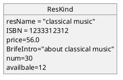

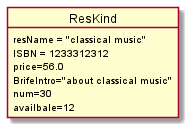

### 2.2 类ReserveRecord的对象图

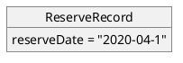

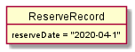

### 2.3 类Reader的对象图

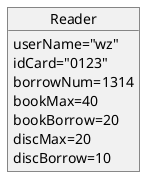
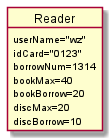

### 2.4 类BorrowRecord的对象图

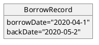
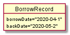

### 2.5 类ResOpt的对象图

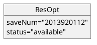
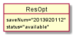

### 2.6 类DiscKind的对象图

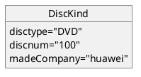
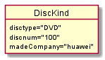

### 2.7 类BookKind的对象图

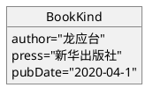

### 2.8 类BookManager的对象图

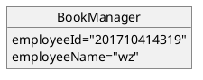
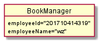

### 2.9 类OverdueRec的对象图

### 2.10 类OverdueRec的对象图

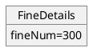

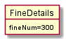
