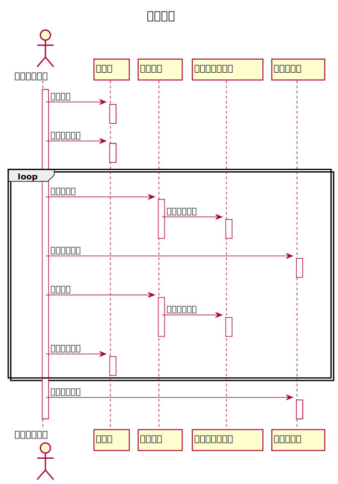
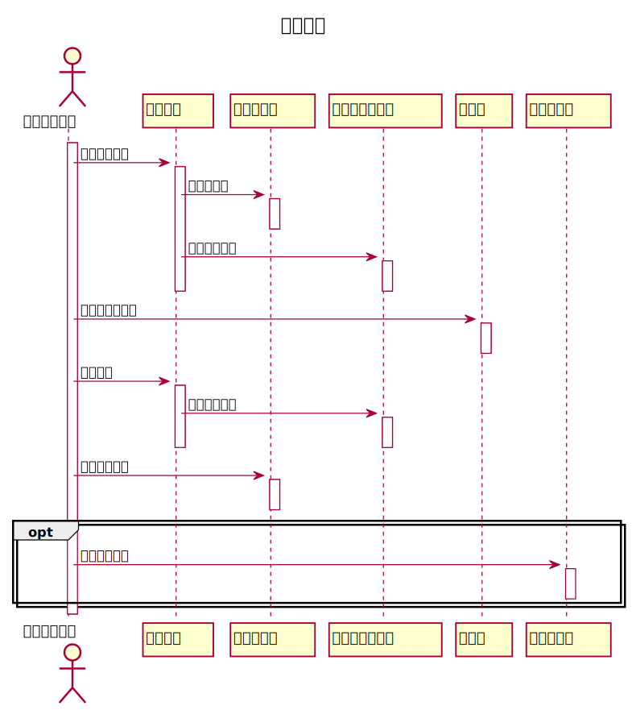

# 实验4：图书管理系统顺序图绘制（老师示范）
| 学号         | 班级         | 姓名     |       
| ------------ | ------------ | -------- | 
| 201710414121 | 软件(本)17-3 | 王珍 | 

## 图书管理系统的顺序图

## 1. 借书用例
## 1.1. 借书用例PlantUML源码

``` sequence
@startuml
title
 借出资源
end title

skinparam sequenceParticipant underline
actor "：图书管理员"
activate "：图书管理员"

"：图书管理员" ->"：读者":验证读者
activate "：读者"
deactivate "：读者"
"：图书管理员" ->"：读者":获取读者限额

loop
activate "：读者"
deactivate "：读者"
"：图书管理员" ->"：资源项":获取资源项
activate "：资源项"
"：资源项" -> "：馆藏资源品种":查找资源品种
activate "：馆藏资源品种"
deactivate "：馆藏资源品种"
deactivate "：资源项"

"：图书管理员" ->"：借书记录":创建借书记录
activate "：借书记录"
deactivate "：借书记录"
"：图书管理员" ->"：资源项":接触资源
activate "：资源项"

"：资源项" ->"：馆藏资源品种":减少可借数量
activate "：馆藏资源品种"
deactivate "：馆藏资源品种"
deactivate "：资源项"
"：图书管理员" ->"：读者":减少可用限额
activate "：读者"
deactivate "：读者"
end

"：图书管理员"->"：借书记录":打印借书清单
activate "：借书记录"
deactivate "：借书记录"
deactivate "：图书管理员"
@enduml
```

## 1.2. 借书用例顺序图


## 1.3. 借书用例顺序图说明
1. 由图书管理员验证读者身份
2. 读者身份验证成功后，图书管理员读取读者限制借书额度
3. 图书管理员获取读者借书所属资源项，并在资源项中查询所借书目的品种
4. 查询该书目存在后，创建借书记录
5. 图书管理员借出资源项，并且减少书目的可借数量
6. 图书管理员减少读者可借书的额度
7. 图书管理员打印借书清单

***

## 2. 还书用例
## 2.1. 还书用例PlantUML源码

``` sequence
@startuml
title
 归还资源
end title

skinparam sequenceParticipant underline
actor "：图书管理员"
activate "：图书管理员"

"：图书管理员" ->"：资源项":读取资源信息
activate "：资源项"
"：资源项" ->"：借书记录":取借书记录
activate "：借书记录"
deactivate "：借书记录"

"：资源项" ->"：馆藏资源品种":取资源的品种
activate "：馆藏资源品种"
deactivate "：馆藏资源品种"
deactivate "：资源项"

"：图书管理员" ->"：读者":读取借阅者信息
activate "：读者"
deactivate "：读者"

"：图书管理员" ->"：资源项":归还资源
activate "：资源项"
"：资源项" ->"：馆藏资源品种":增加可借数量
activate "：馆藏资源品种"
deactivate "：馆藏资源品种"
deactivate "：资源项"

"：图书管理员" ->"：借书记录":登记还书日期
activate "：借书记录"
deactivate "：借书记录"
opt
"：图书管理员" ->"：逾期记录":登记预期记录
activate "：逾期记录"
deactivate "：逾期记录"
end
deactivate "：图书管理员"

@enduml
```

## 2.2. 还书用例顺序图


## 2.3. 还书用例顺序图说明
1. 图书管理员读取资源信息，从资源项中查询读者的借书记录，并得到该书目的所属类别
2. 图书管理员获取读者的借阅信息
3. 图书管理员在资源项中归还书目，同时增加馆藏该书可借数量
4. 图书管理员登记还书日期
5. 图书管理员登记读者逾期记录
***