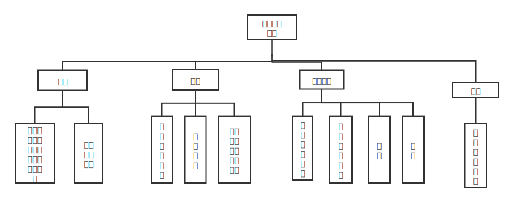
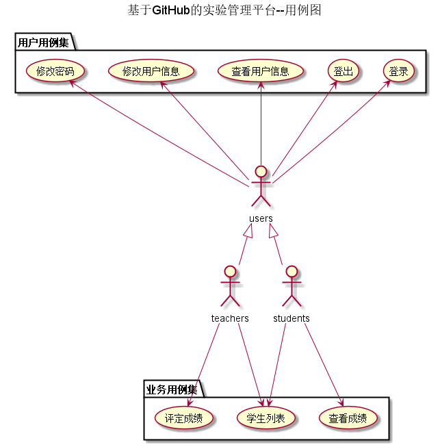
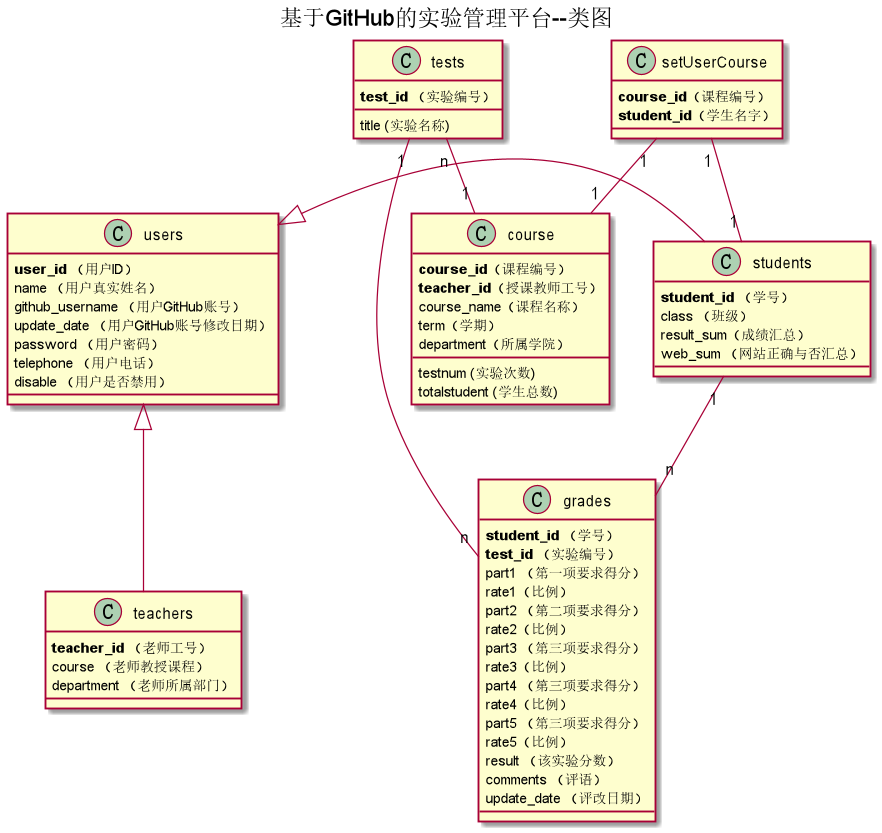

<!-- markdownlint-disable MD033-->
<!-- 禁止MD033类型的警告 https://www.npmjs.com/package/markdownlint -->

# 基于GitHub的实验管理平台的分析与设计

### 成都大学信息科学与工程学院

|学号|班级|姓名|照片|
|:-------:|:-------------: | :----------:|:---:|
|201710414319|软件(本)17-3|王珍||

## 1. 概述
- 基于GitHub的实验管理平台的作用是在线管理实验成绩的Web应用系统。学生和老师的实验内容均存放在GitHUB
页面上。
- 该系统是面向多学期、多课程、多评分标准创建的。
- ##### 学生的功能主要有：  
 ```
 1.设置自己的GitHub用户名、修改个人信息
2.查询自己的实验成绩。每个学生的GitHub用户名是公开的，但成绩不公开
3.学生可以自主选课
```
- ##### 老师的功能主要有：
``` 
1.添加课程
2.批改所教学的每个学生的实验成绩
3.查看每个学生的成绩。
```
- ##### 基本功能
```
1.老师和学生都能通过本系统的链接方便地跳转到学生的每个GitHUB实验目录，以便批改实验或者查看实验情况。
2.实验成绩按数字分数计算，每项实验的满分为100分，最低为0分。
3.系统自动计算每个学生的所有实验的平均分。
```
## 2. 系统总体结构


界面设计参见：https://wangzhenzhenya.github.io/analysis_test6/index.html
    
## 3. 用例图设计 [源码](src/UseCase.puml)


## 4. 类图设计 [源码](src/class.puml)
  
## 5. 数据库设计
- ### [参见数据库设计](./数据库设计.md)

## 6. 用例及界面详细设计
- ### [“登录”用例](./用例/登录.md),[界面](https://wangzhenzhenya.github.io/analysis_test6/登录.html)
> #### 主要功能   
> 1.通过账号和密码登录选择是学生还是老师，系统验证正确则跳到个人主页  
> 2.忘记密码则点击“忘记密码”按钮跳转到找回密码页面  
> 3.没有账号可点击游客模式，跳转到游客模式
- ### [“评定成绩”用例](./用例/评定成绩.md),[界面](https://wangzhenzhenya.github.io/analysis_test6/评定成绩.html)
> #### 主要功能  
> 1.显示同学各项实验的具体要求，老师可输入每个实验的各项评分与批改评语  
> 2.老师通过点击实验名称进入查看学生的作业情况，并给出每个部分的分数  
> 3.老师填完各项分数与评语后点击“提交”，系统将自动计算总分，并动态更新批阅时间  
> 4.此页面可通过点击“上一个”“下一个”来切换学生，也可通过搜索学生姓名跳转到特定的学生评定成绩页面
- ### [“修改密码”用例](./用例/修改密码.md),[界面](https://wangzhenzhenya.github.io/analysis_test6/修改密码.html)
> #### 主要功能  
> 1.输入原密码，验证成功后输入新密码更新数据库
- ### [“找回密码”用例](./用例/找回密码.md),[界面](https://wangzhenzhenya.github.io/analysis_test6/找回密码.html)
> #### 主要功能  
> 1.通过用户之前绑定的手机，发送验证码   
> 2.验证用户输入的信息和验证码是否正确，正确则跳出填写新密码的框，不正确提示用户相关信息错误
- ### [“修改用户信息”用例](./用例/修改用户信息.md),[界面](https://wangzhenzhenya.github.io/analysis_test6/修改信息.html)
> #### 主要功能  
> 1.通过getUserInfo获取用户信息
> 2.用户更改需要更改的信息后点击“提交”按钮，系统更新数据库
- ### [“查看用户信息”用例](./用例/查看用户信息.md),[界面](https://wangzhenzhenya.github.io/analysis_test6/个人信息.html)
> #### 主要功能  
> 1.通过getUserInfo获取用户信息并显示到页面
- ### [“游客模式”用例](./用例/学生列表.md),[界面](https://wangzhenzhenya.github.io/analysis_test6/查看同学.html)
> #### 主要功能 
> 1.显示所有学生学号、姓名、班级、姓名Github名称、个人信息修改最新日期
- ### [“学生选课”用例](./用例/学生选课.md),[界面](https://wangzhenzhenya.github.io/analysis_test6/学生选课.html)
> #### 主要功能  
> 1.学生选择课程参与学习
- ### [“学生列表”用例](./用例/学生列表.md),[界面](https://wangzhenzhenya.github.io/analysis_test6/学生列表.html)
> #### 主要功能  
> 1.显示每位同学的各项实验成绩，老师可以通过“评定成绩按钮”进入到某个同学的成绩评定页面  
> 2.学生的Github栏可连接到学生的Github页面  
> 3.此页面老师仍然可以查看/修改个人信息、修改密码  
- ### [“查看课程信息”用例](./用例/查看课程.md),[界面](https://wangzhenzhenya.github.io/analysis_test6/查看课程.html)
> #### 主要功能  
> 1.通过getCourse获取用户的课程信息
- ### [“老师添加课程”用例](./用例/开课.md),[界面](https://wangzhenzhenya.github.io/analysis_test6/添加课程.html)
> #### 主要功能  
> 1.老师添加新课程并确定开课人数
- ### [“学生首页”](),[界面](https://wangzhenzhenya.github.io/analysis_test6/学生主页.html)
> #### 主要功能  
> 1.学生首页可以查看该学期每门课程实验以及期末的成绩  
> 2.可以查看以往学期的课程及分数  
> 3.查看/修改用户信息  
> 4.修改Github用户
- ### [“老师首页”](),[界面](https://zwdcdu.github.io/is_analysis/test6/ui/index.html)
> #### 主要功能  
> 1.显示本学期教授课程，本期课程可通过点击响应文字任意查看某一门课程的学生列表和打开评定成绩页面  
> 2.以列表形式显示往期课程，往期课程只允许查看学生列表  
> 3.查看/修改用户信息  
> 4.修改Github用户  

    
