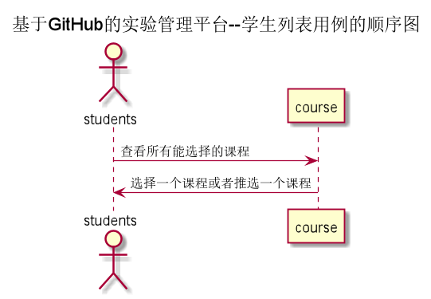

<!-- markdownlint-disable MD033-->
<!-- 禁止MD033类型的警告 https://www.npmjs.com/package/markdownlint -->

# “学生选课”用例 [返回](../README.md)
## 1. 用例规约

|用例名称|修改密码|
|-------|:-------------|
|功能|选择课程|
|参与者|学生|
|前置条件|必须先登录|
|后置条件|不超过课程容量|
|主事件流| |
|备选事件流| |

## 2. 业务流程 [源码](../src/学生选课.puml)
 

## 3. 界面设计
- 界面参照: https://wangzhenzhenya.github.io/analysis_test6/学生选课.html
- API接口调用
    - 接口1：[setUserCourse](../接口/setUserCourse.md)
    - 接口2：[delUserCourse](../接口/delUserCourse.md)

## 4. 算法描述 [源码](../src/学生选课.puml)
  
    
## 5. 参照表
users
SELECT_COURSE
- [USERS](../数据库设计.md/#USERS)
- [SELECT_COURSE](../数据库设计.md/#SELECT_COURSE)
