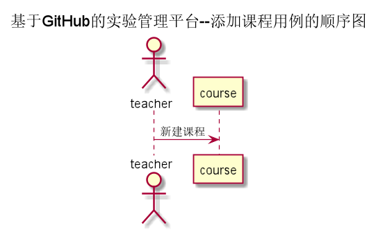

# “开课”用例 [返回](../README.md)
## 1. 用例规约

|用例名称|课程列表|
|-------|:-------------|
|功能|老师新键一个课程,确定开课人数|
|参与者|老师|
|前置条件|老师需要登录|
|后置条件| |
|主事件流| |
|备选事件流| |

## 2. 业务流程（顺序图） [源码](../src/开课.puml)
 

## 3. 界面设计
- 界面参照:https://wangzhenzhenya.github.io/analysis_test6/添加课程.html
- API接口调用
    - 接口1：[addcourse](../接口/addCourse.md) 

## 4. 算法描述
无
    
## 5. 参照表
course
- [COURSE](../数据库设计.md/#COURSE)