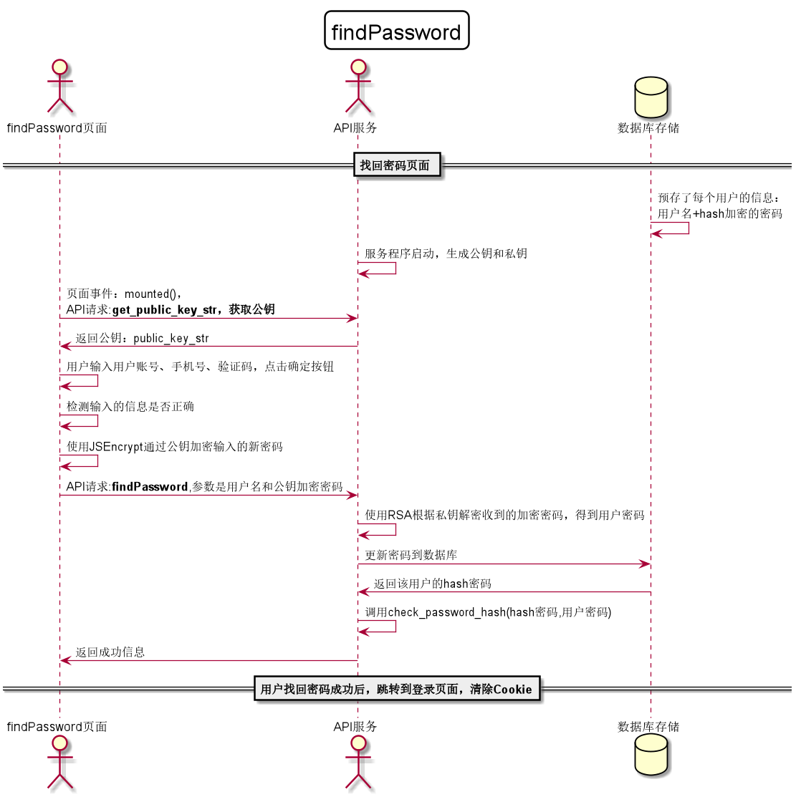

<!-- markdownlint-disable MD033-->
<!-- 禁止MD033类型的警告 https://www.npmjs.com/package/markdownlint -->

# “找回密码”用例 [返回](../README.md)
## 1. 用例规约

|用例名称|找回密码|
|-------|:-------------|
|功能|找回用户的密码|
|参与者|学生，老师|
|前置条件|必须正确输入账号对应手机的验证码|
|后置条件|修改密码以后必须强制登出，再跳转到登录页面|
|主事件流| 1.用户输入正确验证码  2.用户填写新密码（两次输入）   3.用户提交修改信息  4.系统存储修改后密码|
|备选事件流|1a.用户输入验证码错误  &nbsp;&nbsp; 1.系统提示输入的验证码错误 &nbsp;&nbsp; 2.用户重新获取验证码填写并提交    2a. 用户两次输入的密码不同  &nbsp;&nbsp; 1.系统提示两次输入的密码不相同   &nbsp;&nbsp; 2. 用户重新填写并提交。 |

## 2. 业务流程[源码](../src/找回密码.puml)
 

## 3. 界面设计
- 界面参照: https://wangzhenzhenya.github.io/analysis_test6/找回密码.html
- API接口调用
    - 接口1：[setPassword](../接口/setPassword.md)

## 4. 算法描述 
    
## 5. 参照表
users
- [USERS](../数据库设计.md/#USERS)
