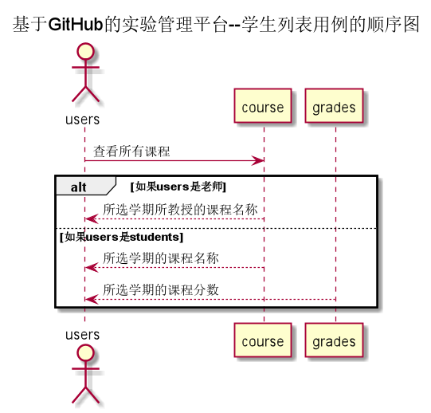

<!-- markdownlint-disable MD033-->
<!-- 禁止MD033类型的警告 https://www.npmjs.com/package/markdownlint -->

# “查看课程”用例 [返回](../README.md)
## 1. 用例规约

|用例名称|查看课程|
|-------|:-------------|
|功能|查看用户的课程|  
|参与者|学生，老师|
|前置条件|必须先登录|
|后置条件| |
|主事件流| |
|备选事件流| |

## 2. 业务流程[源码](../src/查看课程流程图.puml)

## 3. 界面设计
- 界面参照: https://wangzhenzhenya.github.io/analysis_test6/老师主页.html
- API接口调用
    - 接口1：[getCourse](../接口/getCourse.md)
## 4. 算法描述 
   
## 5. 参照表
course
- [USERS](../数据库设计.md/#USERS)
